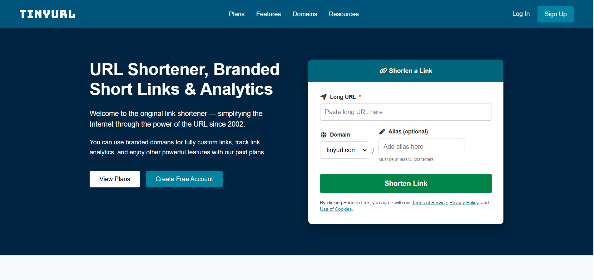

# 🔗 TinyURL Clone

A simple TinyURL Clone built using HTML, CSS, and JavaScript.  
This project allows users to convert long URLs into short, shareable links.

---

## 🚀 Live Demo
👉 [Click Here](https://imaginative-flan-e94718.netlify.app/)

---

## 📌 Features
- 🔗 Convert long URLs into short links
- ✏️ Custom alias support (optional)
- 💾 Uses localStorage to store URLs
- 🔁 Redirects short URL to original link
- 🎨 Clean and responsive UI

---

## 🛠️ Technologies Used
- HTML5
- CSS3
- JavaScript 

---

## ⚙️ How It Works
1. User enters a long URL
2. (Optional) Adds a custom alias
3. App generates a short URL
4. URL is stored in browser localStorage
5. When short link is opened → it redirects to original URL

---

## ⚠️ Limitations
- This is a frontend-only project
- Short links work only in the same browser
- Data is stored in localStorage (not a database)

---

## 📷 Screenshot

---

## 👨‍💻 Author
Anas Javed

---

## ⭐ Give a Star
If you like this project, give it a ⭐ on GitHub!
